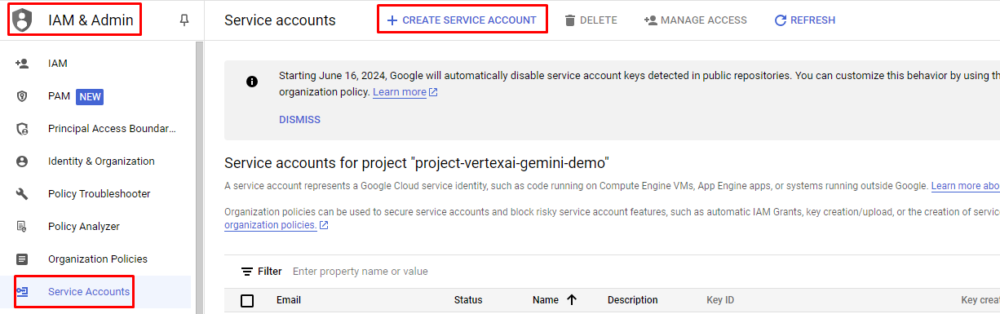
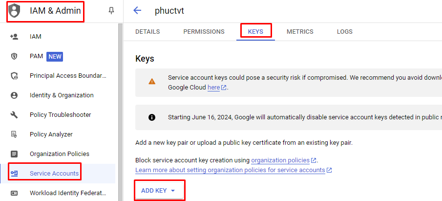

# vertexai-google

- Gemini 1.5 Pro is a foundation model that performs well at a variety of multimodal tasks such as visual understanding, classification, summarization, and creating content from image. It's adept at processing visual and text inputs such as photographs and screenshots.
- Our app allows seamless toggling between VertexAI Gemini 1.5 Pro and Gemini 1.5 Pro, enabling users to switch easily and leverage the best of both versions for enhanced AI-driven solutions.

## Demo
1. Input text to chat bar and click Submit. Here is chatting with VertexAI-Gemini

2. Input text to chat bar and click Submit. Here is chatting with Gemini

3. We can toggle between 2 model by click dropdown model


## Setup
### Gemini
1. You go to the URL here: https://aistudio.google.com/app/apikey and create an API-key

2. Then you can get the API key here


### VertexAI
1. You should log in to https://console.cloud.google.com/ with your account
2. Select Dashboard then create a new project

3. Then you should copy "Project ID" from your project to push to variables file
4. From Dashboard , you scroll down a bit and select "Explore and enable APIs"

5. Select "ENABLE APIS AND SERVICES"

6. then you should search "vertex ai api" and enabled it (gg cloud will request billing account). Then you can use gemini-1.5-pro now
https://console.cloud.google.com/vertex-ai/publishers/google/model-garden/gemini-1.5-pro-001
7. After that, go back to the main page of google cloud and select "IAM & Admin"
8. Select "IAM & Admin" -> "Service Accounts" -> "Create Service Account"

9. Then you can create an account and grant permission/role for this account
10. You have to select the account that you just created and select "Key" and choose "ADD key"

11. "ADD Key" -> "Create new Key" -> "Json" -> then ggCloud automatically download for you a credential json file.
12. Then you keep this file and put the path of the file to `Variables.vertexai-gemini.keyFilePath`
13. You can select the modelName from here: https://console.cloud.google.com/vertex-ai/publishers/google/model-garden/gemini-1.5-pro-001
14. You can select the Location from here: https://cloud.google.com/compute/docs/regions-zones


Add the following `Variables` to your `variables.yaml`:

- `Variables.vertexai-gemini.projectId`
- `Variables.vertexai-gemini.location`
- `Variables.vertexai-gemini.modelName`
- `Variables.vertexai-gemini.keyFilePath`
- `Variables.gemini.apiKey`

and replace the values with your given setup.
```
variables.yaml
```
