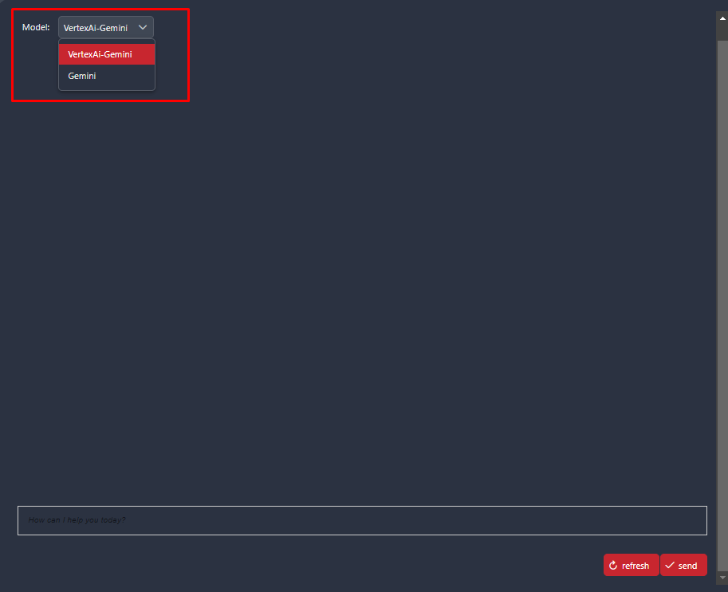
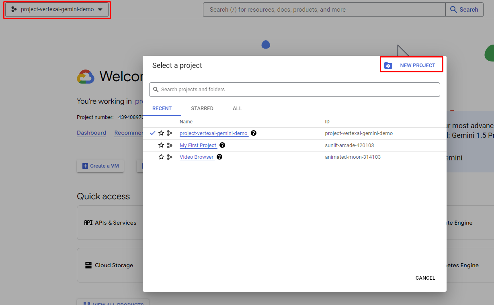
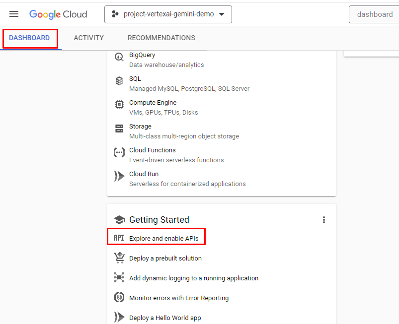

# Vertex AI Google

- Gemini 1.5 Pro is a foundation model that performs well at a variety of multimodal tasks such as visual understanding, classification, summarization, and creating content from image. It's adept at processing visual and text inputs such as photographs and screenshots.
- Our app helps user to chat directly with VertexAI Gemini 1.5 Pro and Gemini 1.5 by sending text and images. It allows seamless toggling between 2 application together.

## Demo
### Submit with model VertexAI-Gemini

### Submit with model Gemini

### We can switch between the two models using a dropdown menu.

## Setup
### Gemini
#### You go to the URL here: [Gemini Online](https://aistudio.google.com/app/apikey) and create an API-key

#### You can get the API key here

### VertexAI
#### You should log in to [Vertex Online](https://console.cloud.google.com/) with your account
#### Select Dashboard -> create a new project

#### You should copy "Project ID" from your project to push to variables file
#### From Dashboard , you scroll down a bit and select "Explore and enable APIs"

#### Select "ENABLE APIS AND SERVICES"

#### You should search "vertex ai api" and enable it (gg cloud will request billing account). [Model Garden Gemini-1.5 pro](https://console.cloud.google.com/vertex-ai/publishers/google/model-garden/gemini-1.5-pro-001)
#### Go back to the main page of Google cloud and select ***"IAM & Admin"***
#### Select ***"IAM & Admin"*** -> ***"Service Accounts"*** -> ***"Create Service Account"***

#### You can create an account and grant permission/role for this account
#### You have to select the account that you just created and select "Key" and choose "ADD key"

#### "ADD Key" -> "Create new Key" -> "Json" -> Google Cloud automatically download for you a credential json file.
#### You keep this file and put the path of the file to `Variables.vertexai-gemini.keyFilePath`
#### You can select the modelName from here: [Vertex AI Gemini Model name](https://console.cloud.google.com/vertex-ai/publishers/google/model-garden/gemini-1.5-pro-001)
#### You can select the Location from here: [Vertex AI Location/Region](https://cloud.google.com/compute/docs/regions-zones)

Add the following `Variables` to your `variables.yaml`:

- `Variables.vertexai-gemini.projectId`
- `Variables.vertexai-gemini.location`
- `Variables.vertexai-gemini.modelName`
- `Variables.vertexai-gemini.keyFilePath`
- `Variables.gemini.apiKey`

and replace the values with your given setup.
